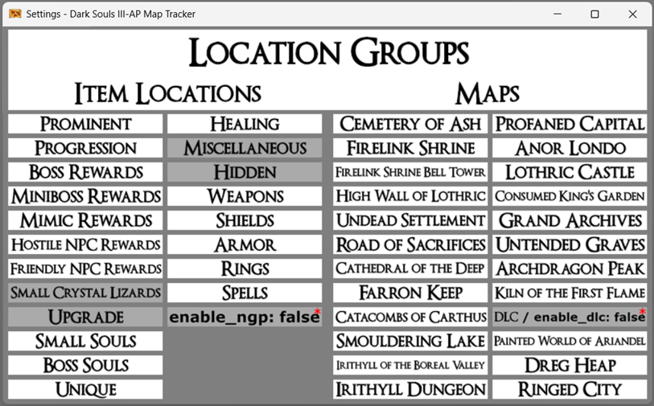

# Dark Souls III Archipelago Map Tracker Pack for PopTracker

This is a Dark Souls III AP Map Tracker for [PopTracker](https://github.com/black-sliver/PopTracker). Designed around [nex3's Dark-Souls-III-Archipelago-client (v3.0.13)](https://github.com/nex3/Dark-Souls-III-Archipelago-client), setup for auto-tracking as well for [Archipelago 0.6.5](https://archipelago.gg/).

## Installation

1. If you haven't already, download [PopTracker](https://github.com/black-sliver/PopTracker/releases/latest).
    - If you have Windows, download the `poptracker_[version]_win64.zip` file.
2. Extract the downloaded file.
3. Download `ds3_tvv1gk.zip` from the [Releases](https://github.com/TVV1GK/DS3_AP_Maptracker/releases/latest) section.
4. Move `ds3_tvv1gk.zip` file into `/poptracker/packs/`.
5. You're all set!

## Connecting to AP

To connect to the AP server for auto-tracking, click on the `AP` button at the top of the tracker and a separate window should pop up asking for you to "__Enter Archipelago host and port__", in which you should type in `archipelago.gg:PORT_NUMBER` (or whatever ip:port combination you're connecting to), select `OK` and then continue to "__Enter slot__" and "__Enter password__" (if the room has no password, leave it blank). Once complete, the `AP` button at the top of the tracker window should turn "Green" meaning you are now auto-tracking!

## Location Groups filtering

The auto-tracker isn't able to get `exclude_locations` and `excluded_location_behavior` settings from the server. For this specific reason I created a way to manually filter location groups like `exclude_locations`. Left of the `AP` button is an `Open Pack Settings` button. It should bring up a window like this:

### How to use it?

- **Currently, Archipelago tracks `exclude_locations` and missable locations, even when they're set to `do_not_randomize`. For this reason, I recommend using the filters to include ONLY important locations (= locations that can have progression/key items) by turning off every location group included in `exclude_locations` despite what it's set to.**
    - Although, if you have `excluded_location_behavior` set to `allow_useful`, you can leave these location groups ON, but you should know that these locations won't have progression/key items.
- The auto-tracker can only and will set automatically `enable_ngp` and `enable_dlc`. These groups have red asterisks next to them.
- Grayed: OFF / Bright: ON -> ON means that locations with this trait can be displayed.
- A location will be displayed on the map if its every trait is ON:
    - `Everywhere` is ON if anything else is ON (because it's a trait of every location),
    - `DLC / enable_dlc` is ON if any DLC map is ON,
    - i.e. `FS: Skull Ring - kill Ludleth` will be on the map if `Everywhere`, `Friendly NPC Rewards`, `Hidden`, `Rings` and `Firelink Shrine` is ON at the same time.
- Missable locations are NOT implemented!
    - Every location that can have a progression/key item is implemented!

## Credits
- [DS3_AP_Maptracker](https://github.com/Br00ty/DS3_AP_Maptracker) by Br00ty
- [Dark Souls 3 Wiki (fextralife.com)](https://darksouls3.wiki.fextralife.com/Dark+Souls+3+Wiki) for the assets
- [PopTracker](https://github.com/black-sliver/PopTracker) by black-sliver
- [Dark-Souls-III-Archipelago-client](https://github.com/nex3/Dark-Souls-III-Archipelago-client) by nex3 and Marechal-L
