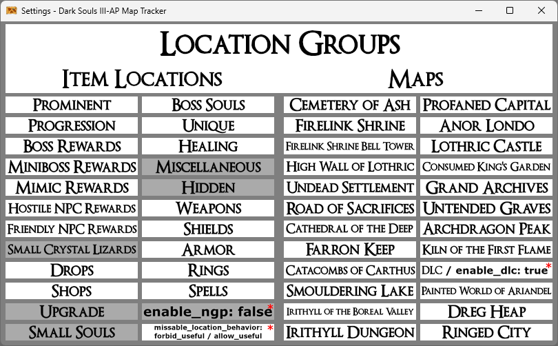

# Dark Souls III Archipelago Map Tracker Pack for PopTracker

This is a Dark Souls III AP Map Tracker for [PopTracker](https://github.com/black-sliver/PopTracker). Designed around [fswap's from-software-archipelago-clients (v4.0.X)](https://github.com/fswap/from-software-archipelago-clients), setup for auto-tracking as well for [Archipelago 0.6.X](https://archipelago.gg/).

> #### ⚠️ Warning ⚠️
> If you generated a room on [archipelago.gg](https://archipelago.gg/), or you want to use this tracker pack with [nex3's Dark-Souls-III-Archipelago-client (v3.0.13)](https://github.com/nex3/Dark-Souls-III-Archipelago-client), you should [download the v1.0.6 version](https://github.com/TVV1GK/DS3_AP_Maptracker/releases/v1.0.6), but keep in mind that it won't be updated anymore.

*Archipelago will be referred to as AP from now on.*

## Installation

1. If you haven't already, download [PopTracker](https://github.com/black-sliver/PopTracker/releases/latest).
    - If you have Windows, download the `poptracker_[version]_win64.zip` file.
2. Extract the downloaded file.
3. Download `ds3_tvv1gk.zip` from the [Releases](https://github.com/TVV1GK/DS3_AP_Maptracker/releases/latest) section (you can ren).
4. Move `ds3_tvv1gk.zip` file into `/poptracker/packs/`.
5. You're all set!

## Connecting to AP

To connect to the AP server for auto-tracking, click on the `AP` button at the top of the tracker and a separate window should pop up asking for you to "__Enter Archipelago host and port__", in which you should enter `archipelago.gg:PORT_NUMBER` (or whatever ip:port combination you're connecting to), and then continue to "__Enter slot__" and "__Enter password__" (if the room has no password, leave it blank). Once complete, the `AP` button at the top of the tracker window should turn green meaning you are now auto-tracking!

## Pack Variants

#### AP Map Tracker
This is the default variant. You can use it without connection to the AP server, but the following won't be displayed as intended:
- Yhorm's placement won't be tracked, so soft logic for locations blocked by him won't be applied and will show those locations as reachable.
- Soft logic for locations requiring killing NPCs won't be applied, so all NPC tied locations will be shown as reachable.

#### AP Map Tracker (all soft logic)
This variant should only be used with connection to the AP server, because it tracks all progression items, but not all of them are displayed and modifiable by the user.
Without connection to the AP server, the functionality of this variant is the same as [AP Map Tracker](#ap-map-tracker).

#### Items Only
This can be used to track only progression items.

## Location Groups filtering

The auto-tracker isn't able to get `exclude_locations` and `excluded_location_behavior` settings from the server. For this specific reason I created a way to manually filter location groups like `exclude_locations`. Left of the `AP` button is an `Open Pack Settings` button. It should bring up a window like this:

### How to use it?

- **Currently, AP tracks both excluded and missable locations (even when they're set to `do_not_randomize`). For this reason, I recommend using the filters to include ONLY locations that can have progression items by turning off every location group included in `exclude_locations`.**
    - Although, you can leave these location groups ON, but you should know that these locations won't have progression items.
- Grayed: OFF / Bright: ON
    - ON means that locations with this trait can be displayed
- The groups, that have red asterisks next to them, should match your AP options.
    - `DLC / enable_dlc` should be turned on only if `DLC` isn't included in `exclude_locations` AND `enable_dlc` is set to `true`.
    - The auto-tracker can only set `DLC / enable_dlc` partially , and can't get `missable_location_behavior` at all, so you should check the settings manually every time you connect to the AP server.
- A location will be displayed on the map if its every trait is ON:
    - i.e. `FS: Skull Ring - kill Ludleth` will be displayed on the map if `Friendly NPC Rewards`, `Hidden`, `Rings` and `Firelink Shrine` is ON at the same time.
- Every location that can have a progression item is implemented!
    - Missable locations are only implemented on the backend! If you wish to help with implementing them on the frontend, feel free to ask me or open a PR!
        - Currently, setting `missable_location_behavior` to OFF hides locations tied to any missable progression item - without randomization, those locations become missable.

## Credits
- [DS3_AP_Maptracker](https://github.com/Br00ty/DS3_AP_Maptracker) by Br00ty
- [Dark Souls 3 Wiki (fextralife.com)](https://darksouls3.wiki.fextralife.com/Dark+Souls+3+Wiki) for the assets
- [PopTracker](https://github.com/black-sliver/PopTracker) by black-sliver
- [Dark-Souls-III-Archipelago-client](https://github.com/nex3/Dark-Souls-III-Archipelago-client) by nex3 and Marechal-L
- [from-software-archipelago-clients](https://github.com/fswap/from-software-archipelago-clients) by fswap
