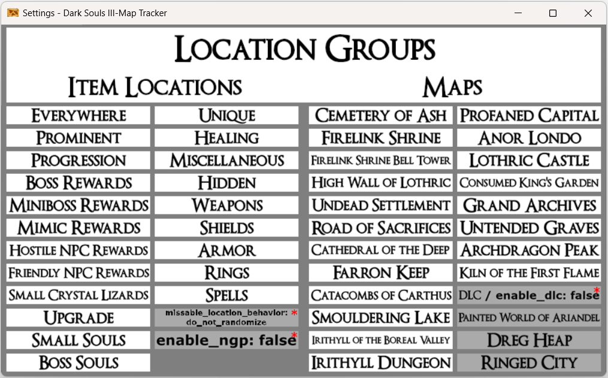

# Dark Souls III Archipelago Map Tracker Pack for PopTracker

This is a Dark Souls III AP Map Tracker for [PopTracker](https://github.com/black-sliver/PopTracker). Designed around [nex3's Dark-Souls-III-Archipelago-client (v3.0.1)](https://github.com/nex3/Dark-Souls-III-Archipelago-client), setup for auto-tracking as well for [Archipelago 0.6.1](https://archipelago.gg/).

## Installation

Download the latest release (`ds3_tvv1gk.zip`) from the releases section, and then move it into `/poptracker/packs/` and you're all set!

## Connecting to AP

To connect to the AP server for auto-tracking, click on the `AP` button at the top of the tracker and a separate window should pop up asking for you to "__Enter Archipelago host and port__", in which you should type in `archipelago.gg:PORT_NUMBER` (or whatever ip:port combination you're connecting to), select `OK` and then continue to "__Enter slot__" and "__Enter password__" (if the room has no password, leave it blank). Once complete, the `AP` button at the top of the tracker window should turn "Green" meaning you are now auto-tracking!

## Location Groups filtering

### `missable_location_behavior` is not implemented yet!

The auto-tracker isn't able to get `exclude_locations`, `excluded_location_behavior` and `missable_location_behavior` from the server. For this specific reason I created a way to manually filter location groups like `exclude_locations`. Next to the `AP` button is an `Open Pack Settings` button. It should bring up a window like this:

### How to use it?

- **Only use this if in your setting/yaml `excluded_location_behavior` is set to `do_not_randomize`**
- Grayed: OFF / Bright: ON -> ON means it isn't included in `exclude_locations`
- The auto-tracker can only set automatically `enable_ngp` and `enable_dlc`
- A location will be available on the map if its every trait is ON:
    - `Everywhere` is ON if anything else is ON (because it's a trait of every location)
    - `DLC / enable_dlc` is ON if any DLC map is ON
    - i.e. `FS: Skull Ring - kill Ludleth` will be on the map if `Everywhere`, `Friendly NPC Rewards`, `Hidden`, `Rings` and `Firelink Shrine` is ON at the same time
- Filters with red asterisk (*****) are for grabbing your attention, because they're important
- `missable_location_behavior` is not implemented yet!
    - Every location that can have a progression/key item is implemented

## Credits
- [DS3_AP_Maptracker](https://github.com/Br00ty/DS3_AP_Maptracker) by Br00ty
- [Dark Souls 3 Wiki (fextralife.com)](https://darksouls3.wiki.fextralife.com/Dark+Souls+3+Wiki) for the assets
- [PopTracker](https://github.com/black-sliver/PopTracker) by black-sliver
- [Dark-Souls-III-Archipelago-client](https://github.com/nex3/Dark-Souls-III-Archipelago-client) by nex3 and Marechal-L
